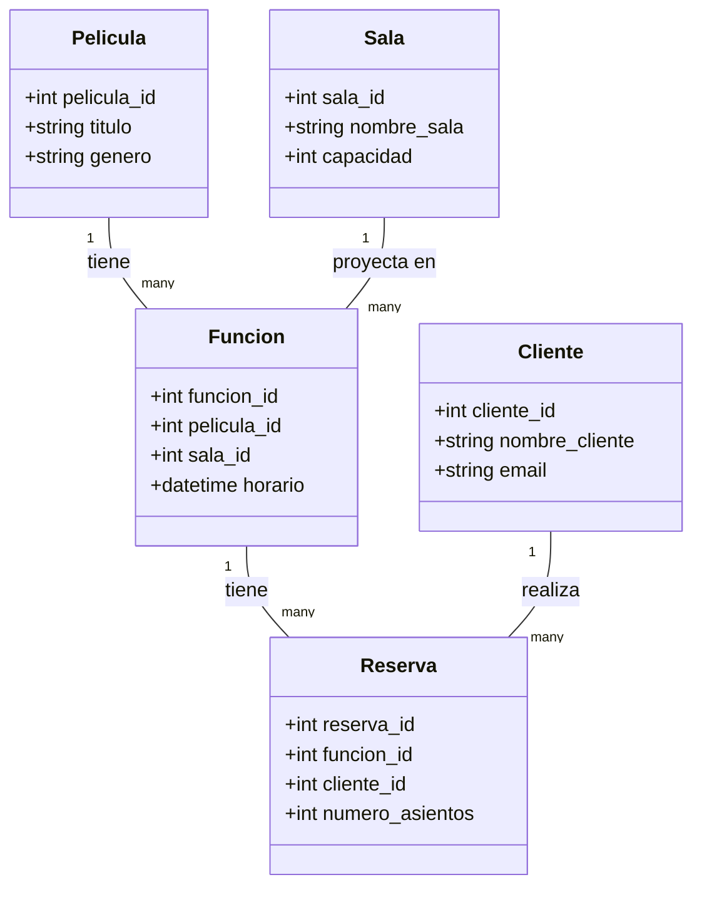

# Diagrama UML de la Base de Datos para CineApp

Este documento describe la estructura de la base de datos para la aplicación CineApp, basada en los requisitos del `README.md`.

## Diagrama de Clases (UML)

A continuación se presenta un diagrama de clases que representa las tablas de la base de datos, sus atributos y las relaciones entre ellas.

## Descripción de las Entidades

### Pelicula
Almacena la información de cada película.
- **pelicula_id**: Identificador único para cada película (Llave Primaria).
- **titulo**: Título de la película.
- **genero**: Género de la película.

### Sala
Representa una sala de cine.
- **sala_id**: Identificador único para cada sala (Llave Primaria).
- **nombre_sala**: Nombre o número de la sala.
- **capacidad**: Número total de asientos en la sala.

### Funcion
Representa una proyección específica de una película en una sala y horario determinados.
- **funcion_id**: Identificador único para cada función (Llave Primaria).
- **pelicula_id**: Referencia a la película que se proyecta (Llave Foránea).
- **sala_id**: Referencia a la sala donde se proyecta (Llave Foránea).
- **horario**: Fecha y hora de la función.

### Cliente
Almacena la información de los clientes que realizan reservas.
- **cliente_id**: Identificador único para cada cliente (Llave Primaria).
- **nombre_cliente**: Nombre del cliente.
- **email**: Correo electrónico del cliente.

### Reserva
Representa una reserva de entradas hecha por un cliente para una función específica.
- **reserva_id**: Identificador único para cada reserva (Llave Primaria).
- **funcion_id**: Referencia a la función para la que se hace la reserva (Llave Foránea).
- **cliente_id**: Referencia al cliente que hace la reserva (Llave Foránea).
- **numero_asientos**: Cantidad de asientos reservados.
