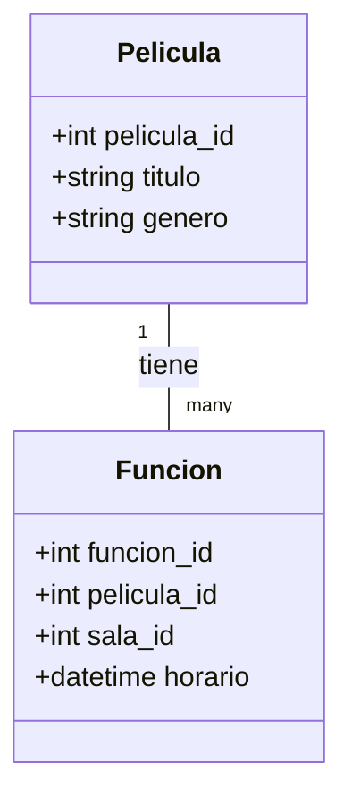
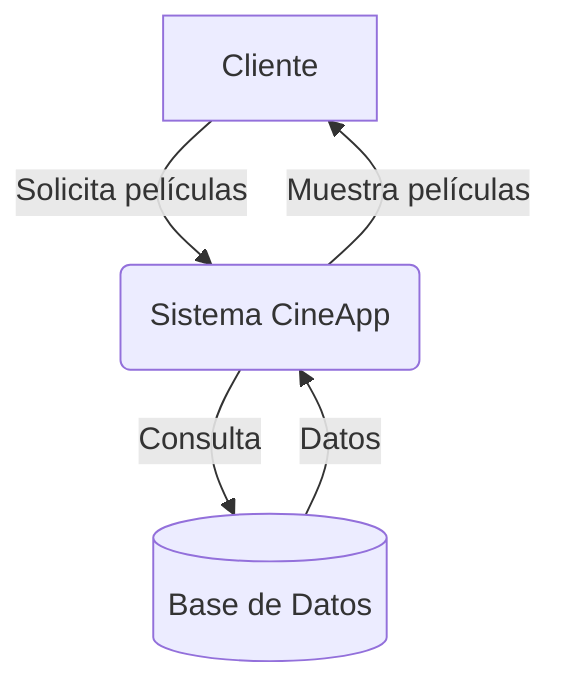
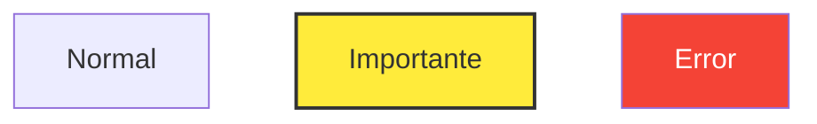
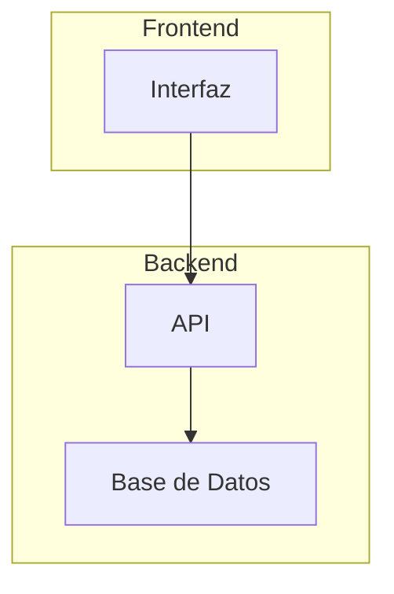

# 📊 Guía para Crear Esquemas y Diagramas de Documentación

Esta guía te enseña cómo crear los diagramas de documentación del proyecto usando **Mermaid**, una herramienta que permite crear diagramas con sintaxis tipo Markdown.

## 🎯 ¿Qué es Mermaid?

Mermaid es un lenguaje de diagramación basado en texto que se renderiza como gráficos. Se integra fácilmente con:
- **GitHub** (renderiza automáticamente en archivos .md)
- **GitLab**
- **VS Code** (con extensiones)
- **Notion, Obsidian, etc.**

## 📚 Tipos de Diagramas en CineApp

### 1. Diagrama UML de Base de Datos (Class Diagram)

**Archivo:** `database/database_uml.md`

**Sintaxis Básica:**
```markdown
# Diagrama UML

\`\`\`mermaid
classDiagram
    class NombreClase {
        +tipo atributo1
        +tipo atributo2
        metodo()
    }
    
    class OtraClase {
        +int id
        +string nombre
    }
    
    NombreClase "1" -- "many" OtraClase : relacion
\`\`\`
```

**Ejemplo del Proyecto:**


**Tipos de relaciones:**
- `"1" -- "many"` : Uno a muchos
- `"1" -- "1"` : Uno a uno
- `"many" -- "many"` : Muchos a muchos
- `<|--` : Herencia
- `*--` : Composición
- `o--` : Agregación

---

### 2. Diagrama de Flujo de Datos (Data Flow Diagram)

**Archivo:** `docs/data_flow_diagram.md`

**Sintaxis Básica:**
```markdown
\`\`\`mermaid
graph TD
    A[Entidad Externa] -->|acción| B(Proceso)
    B -->|datos| C[Almacén de Datos]
    C -->|datos| B
    B -->|resultado| A
\`\`\`
```

**Formas disponibles:**
- `A[...]` : Rectángulo (Entidad Externa)
- `B(...)` : Rectángulo redondeado (Proceso)
- `C{...}` : Rombo (Decisión)
- `D[(...)]` : Cilindro (Base de Datos)
- `E((...)` : Círculo

**Direcciones:**
- `TD` o `TB` : Top to Bottom (arriba a abajo)
- `LR` : Left to Right (izquierda a derecha)
- `RL` : Right to Left
- `BT` : Bottom to Top

**Ejemplo:**


---

### 3. Diagrama de Casos de Uso (Use Case Diagram)

**Archivo:** `docs/use_case_diagram.md`

**Sintaxis Básica:**
```markdown
\`\`\`mermaid
graph TD
    Cliente[👤 Cliente]
    Admin[👤 Administrador]

    subgraph Sistema["Sistema"]
        UC1((Caso de Uso 1))
        UC2((Caso de Uso 2))
    end

    Cliente --> UC1
    Admin --> UC2
    UC1 -.->|include| UC2
\`\`\`
```

**Relaciones:**
- `-->` : Asociación
- `-.->` : Include/Extend (línea punteada)

**Formas:**
- `[👤 Nombre]` : Actor (rectángulo con emoji)
- `((Nombre))` : Caso de uso (círculo)
- `subgraph` : Sistema/Contexto

---

### 4. Diagrama de Flujo de Trabajo (Workflow)

**Archivo:** `docs/workflow_diagram.md`

**Sintaxis Básica:**
```markdown
\`\`\`mermaid
graph TD
    A[Inicio] --> B{Decisión?}
    B -- Sí --> C[Proceso 1]
    B -- No --> D[Proceso 2]
    C --> E[Fin]
    D --> E
\`\`\`
```

**Elementos de flujo:**
- Nodos de inicio/fin: `[Inicio]`, `[Fin]`
- Decisiones: `{Pregunta?}`
- Procesos: `[Acción]` o `(Acción)`

---

### 5. Diagrama de Secuencia (Sequence Diagram)

**Para interacciones entre componentes:**

```markdown
\`\`\`mermaid
sequenceDiagram
    participant Cliente
    participant API
    participant BaseDatos

    Cliente->>API: GET /api/peliculas
    API->>BaseDatos: SELECT * FROM Pelicula
    BaseDatos-->>API: Resultados
    API-->>Cliente: JSON con películas
\`\`\`
```

**Tipos de flechas:**
- `->>` : Mensaje síncrono
- `-->>` : Respuesta
- `-x` : Mensaje perdido
- `--x` : Respuesta perdida

---

### 6. Diagrama Entidad-Relación (ER Diagram)

```markdown
\`\`\`mermaid
erDiagram
    PELICULA ||--o{ FUNCION : tiene
    SALA ||--o{ FUNCION : "proyecta en"
    FUNCION ||--o{ RESERVA : tiene
    CLIENTE ||--o{ RESERVA : realiza

    PELICULA {
        int pelicula_id PK
        string titulo
        string genero
    }

    FUNCION {
        int funcion_id PK
        int pelicula_id FK
        int sala_id FK
        datetime horario
    }
\`\`\`
```

**Cardinalidad:**
- `||--||` : Uno a uno
- `||--o{` : Uno a muchos
- `}o--o{` : Muchos a muchos
- `||--o|` : Uno a cero o uno

---

## 🛠️ Herramientas para Crear y Visualizar

### 1. Editor Online
- **Mermaid Live Editor**: https://mermaid.live/
  - Edita en tiempo real
  - Exporta como PNG, SVG, o Markdown
  - Muy útil para probar sintaxis

### 2. VS Code
**Extensiones recomendadas:**
- **Markdown Preview Mermaid Support**
- **Mermaid Editor**
- **Mermaid Markdown Syntax Highlighting**

**Instalación:**
```bash
code --install-extension bierner.markdown-mermaid
```

### 3. GitHub
Los archivos `.md` con bloques Mermaid se renderizan automáticamente en GitHub.

### 4. Otras herramientas
- **Draw.io / diagrams.net** - Para diagramas más complejos
- **PlantUML** - Alternativa a Mermaid
- **Lucidchart** - Herramienta comercial

---

## 📝 Plantillas para CineApp

### Crear nuevo Diagrama de Flujo

```markdown
# Diagrama de [Nombre del Proceso]

\`\`\`mermaid
graph TD
    A[Inicio] --> B[Paso 1]
    B --> C{Decisión}
    C -- Opción 1 --> D[Acción A]
    C -- Opción 2 --> E[Acción B]
    D --> F[Fin]
    E --> F
\`\`\`

## Descripción
[Explica el proceso aquí]
```

### Crear nuevo Diagrama UML

```markdown
# Diagrama UML - [Módulo]

\`\`\`mermaid
classDiagram
    class NuevaClase {
        +int id
        +string nombre
        metodo()
    }
\`\`\`

## Descripción de Entidades
### NuevaClase
- **id**: Identificador único
- **nombre**: [Descripción]
```

---

## 🎨 Estilos y Personalización

### Agregar clases CSS (colores)



### Subgrafos



---

## 🚀 Proceso para Agregar Nuevo Diagrama

1. **Identifica el tipo** de diagrama que necesitas
2. **Usa la plantilla** correspondiente
3. **Edita en Mermaid Live Editor** para visualizar en tiempo real
4. **Copia el código** a un archivo `.md` en la carpeta correcta:
   - `/database/` para diagramas de BD
   - `/docs/` para documentación general
5. **Agrega descripción** en texto después del diagrama
6. **Prueba en GitHub** para ver cómo se renderiza

---

## 📖 Recursos Adicionales

- **Documentación oficial**: https://mermaid.js.org/
- **Tutorial interactivo**: https://mermaid.js.org/intro/
- **Ejemplos**: https://github.com/mermaid-js/mermaid/tree/develop/docs/syntax
- **Cheat Sheet**: https://jojozhuang.github.io/tutorial/mermaid-cheat-sheet/

---

## 💡 Consejos

1. **Mantén los diagramas simples** - Si es muy complejo, divídelo en varios
2. **Usa nombres descriptivos** - Mejor "VerificarDisponibilidad" que "Proceso1"
3. **Agrega leyendas** - Explica símbolos o colores especiales
4. **Mantén consistencia** - Usa el mismo estilo en todos los diagramas
5. **Documenta debajo** - Siempre agrega descripción textual
6. **Versiona cambios** - Usa Git para trackear cambios en diagramas

---

## ❓ Solución de Problemas

### El diagrama no se renderiza en GitHub
- Verifica que los bloques sean \`\`\`mermaid (no \`\`\`markdown)
- Asegúrate de que la sintaxis sea correcta
- Prueba primero en Mermaid Live Editor

### Errores de sintaxis comunes
- Falta de espacios: `A-->B` ✗  →  `A --> B` ✓
- Comillas mal cerradas
- Caracteres especiales sin escapar
- IDs duplicados en el mismo diagrama

---

¡Listo! Ahora puedes crear y modificar todos los diagramas de documentación del proyecto.
