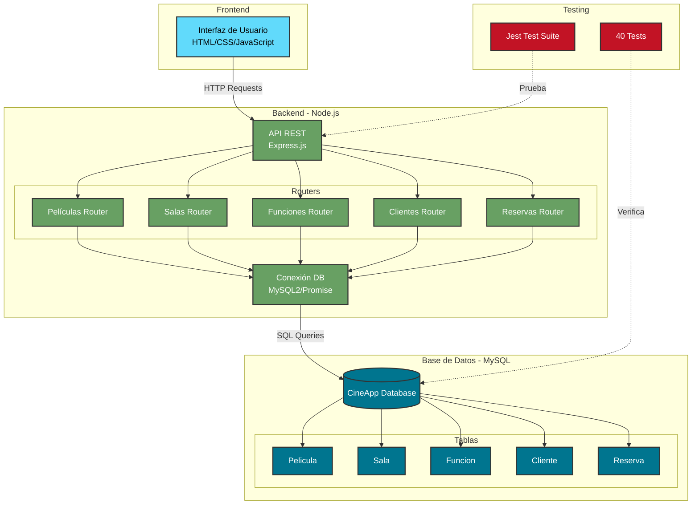
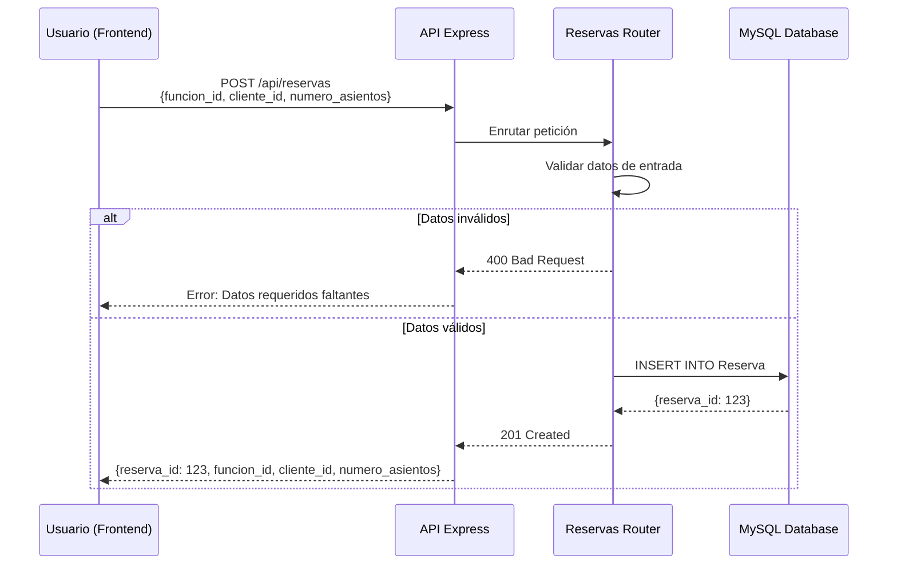
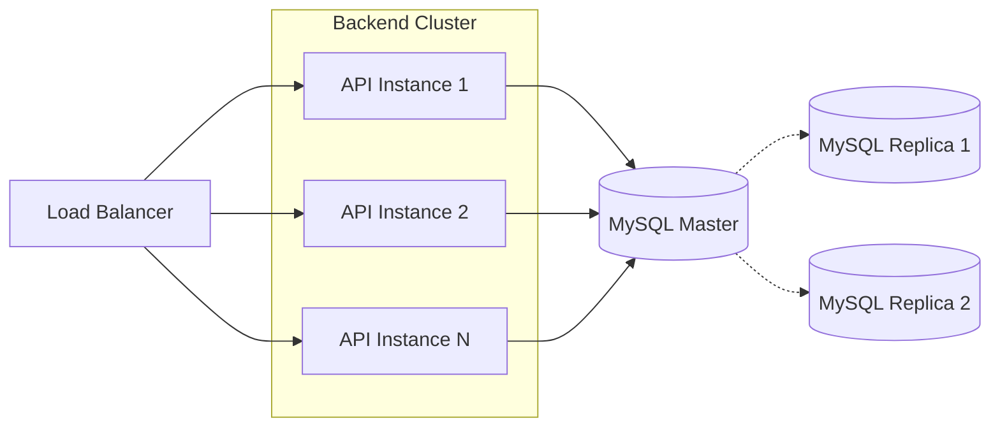

# Diagrama de Arquitectura del Sistema

Este diagrama muestra la arquitectura general de CineApp y cómo interactúan sus componentes principales.

## Arquitectura de Componentes



## Descripción de Componentes

### Frontend
- **Interfaz de Usuario**: Aplicación web construida con HTML, CSS y JavaScript vanilla
- **Comunicación**: Realiza peticiones HTTP a la API REST
- **Puerto**: Típicamente 8080 (http-server)

### Backend - API REST
- **Framework**: Express.js sobre Node.js
- **Puerto**: 3000
- **Funcionalidad**: Maneja todas las operaciones CRUD para las 5 entidades principales

#### Routers (Módulos de API)
1. **Películas Router** (`/api/peliculas`)
   - GET: Listar todas las películas
   - POST: Crear nueva película
   - GET /:id: Obtener película específica
   - PUT /:id: Actualizar película
   - DELETE /:id: Eliminar película

2. **Salas Router** (`/api/salas`)
   - CRUD completo para gestión de salas

3. **Funciones Router** (`/api/funciones`)
   - Gestión de horarios y proyecciones

4. **Clientes Router** (`/api/clientes`)
   - Administración de clientes

5. **Reservas Router** (`/api/reservas`)
   - Gestión de reservas y disponibilidad

### Base de Datos
- **Motor**: MySQL
- **Pool de Conexiones**: mysql2/promise con conexiones pooled
- **Tablas**: 5 tablas principales con relaciones FK

#### Relaciones entre Tablas
```
Pelicula (1) --> (*) Funcion
Sala (1) --> (*) Funcion
Funcion (1) --> (*) Reserva
Cliente (1) --> (*) Reserva
```

### Testing
- **Framework**: Jest
- **Cobertura**: 40 tests distribuidos en 5 suites
- **Base de Datos de Test**: Configuración separada en `.env.test`

## Flujo de Datos

### Ejemplo: Crear una Reserva



## Stack Tecnológico

| Capa | Tecnología | Versión |
|------|-----------|---------|
| Frontend | HTML5, CSS3, JavaScript | ES6+ |
| Backend | Node.js | 14+ |
| Framework Web | Express.js | 4.x |
| Base de Datos | MySQL | 8.0+ |
| Driver DB | mysql2 | Latest |
| Testing | Jest | 27+ |
| Servidor HTTP | http-server | Latest |

## Variables de Entorno

```bash
# Backend (.env)
DB_HOST=localhost
DB_USER=root
DB_PASSWORD=tu_password
DB_NAME=CineApp

# Testing (.env.test)
DB_HOST=localhost
DB_USER=root
DB_PASSWORD=tu_password
DB_NAME=CineApp_Test
```

## Patrones de Diseño Utilizados

1. **Router Pattern**: Separación de rutas en módulos independientes
2. **Connection Pooling**: Reutilización eficiente de conexiones DB
3. **RESTful API**: Arquitectura basada en recursos y métodos HTTP
4. **Separation of Concerns**: Frontend, Backend y DB claramente separados

## Escalabilidad y Mejoras Futuras

### Posibles Mejoras
- [ ] Agregar capa de servicios (Service Layer)
- [ ] Implementar autenticación JWT
- [ ] Agregar cache con Redis
- [ ] Implementar GraphQL como alternativa a REST
- [ ] Dockerizar la aplicación
- [ ] Agregar CI/CD pipeline
- [ ] Implementar logging centralizado
- [ ] Agregar monitoreo con Prometheus/Grafana

### Escalabilidad Horizontal


## Referencias

- [Express.js Documentation](https://expressjs.com/)
- [MySQL Documentation](https://dev.mysql.com/doc/)
- [Jest Documentation](https://jestjs.io/)
- [REST API Best Practices](https://restfulapi.net/)
