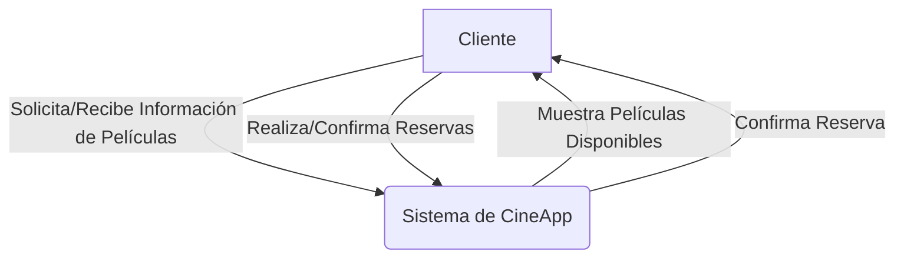
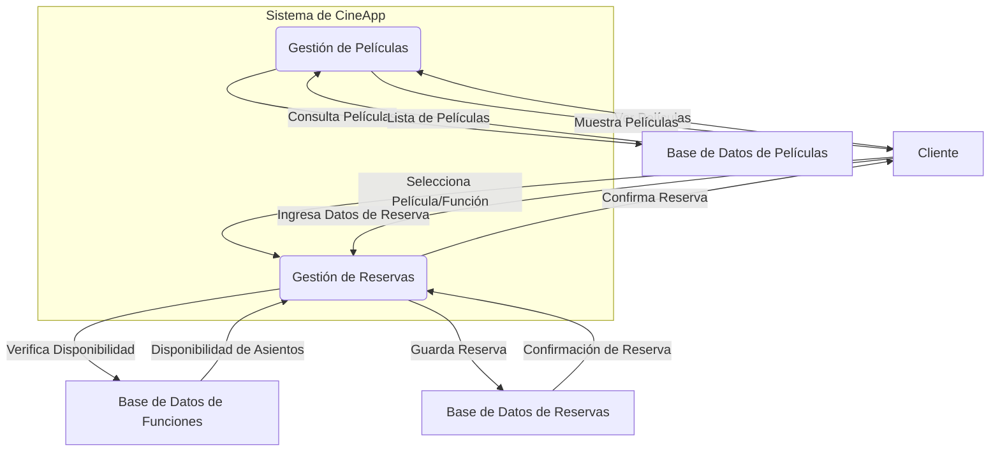

# Diagrama de Flujo de Datos (DFD) para CineApp

Este documento presenta los Diagramas de Flujo de Datos (DFD) para la aplicación CineApp, describiendo cómo los datos se mueven a través del sistema.

## DFD Nivel 0: Diagrama de Contexto

El Diagrama de Contexto muestra el sistema como un único proceso, interactuando con entidades externas.

## DFD Nivel 1: Descomposición del Sistema de CineApp

El DFD Nivel 1 descompone el proceso principal "Sistema de CineApp" en sus subprocesos principales y cómo interactúan con los almacenes de datos.

