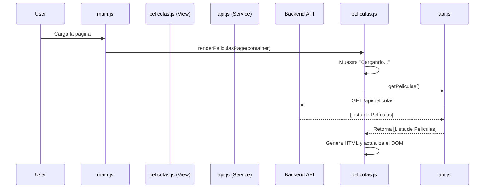

# Arquitectura del Frontend (JavaScript Vanilla - Enfoque Modular)

## 1. Introducción

Este documento describe una arquitectura modular para el frontend de CineApp utilizando **HTML, CSS y JavaScript vanilla**. El objetivo es organizar el código de una manera que refleje la estructura de la API, haciendo que el frontend sea más fácil de mantener y escalar sin introducir un framework.

El enfoque principal será separar la lógica en "vistas" que corresponden a las principales secciones de la aplicación (ej. Películas, Reservas), con un script principal (`main.js`) que actúa como orquestador.

## 2. Estructura de Archivos

Se propone la siguiente estructura de archivos dentro de la carpeta `frontend/`:

```
frontend/
├── index.html              # Punto de entrada de la aplicación
├── js/
│   ├── main.js             # Lógica principal, orquestación
│   ├── views/              # Módulos para cada sección/vista
│   │   └── peliculas.js
│   └── services/           # Comunicación con la API
│       └── api.js
└── style/
    └── style.css           # Estilos generales
```

## 3. Módulos y Responsabilidades

### `main.js` (Orquestador)
Este archivo es el punto de entrada. Su única responsabilidad es inicializar la aplicación y llamar a los módulos de las vistas para que rendericen su contenido.

```javascript
// js/main.js
import { renderPeliculasPage } from './views/peliculas.js';

document.addEventListener('DOMContentLoaded', () => {
    const mainContainer = document.getElementById('app'); // El contenedor principal en index.html
    renderPeliculasPage(mainContainer);
});
```

### `services/api.js` (Servicio de API)
Este módulo centraliza todas las llamadas `fetch` al backend. Proporciona funciones que pueden ser importadas por cualquier vista que necesite datos.

```javascript
// js/services/api.js
const API_BASE_URL = 'http://localhost:3000/api';

export async function getPeliculas() {
    try {
        const response = await fetch(`${API_BASE_URL}/peliculas`);
        if (!response.ok) {
            throw new Error(`Error en la red: ${response.statusText}`);
        }
        return await response.json();
    } catch (error) {
        console.error('Error al obtener las películas:', error);
        return []; // Devolver un array vacío en caso de error
    }
}
```

### `views/peliculas.js` (Vista de Películas)
Este módulo contiene toda la lógica relacionada con la sección de películas: obtener los datos (usando el servicio `api.js`) y renderizarlos en el DOM.

```javascript
// js/views/peliculas.js
import { getPeliculas } from '../services/api.js';

/**
 * Obtiene las películas y las renderiza en el contenedor proporcionado.
 * @param {HTMLElement} container - El elemento del DOM donde se renderizará la vista.
 */
export async function renderPeliculasPage(container) {
    container.innerHTML = '<p>Cargando películas...</p>';

    const movies = await getPeliculas();

    if (movies.length === 0) {
        container.innerHTML = '<p>No hay películas para mostrar.</p>';
        return;
    }

    const moviesHtml = movies.map(movie => {
        return `
            <div class="movie-card">
                <h2>${movie.titulo}</h2>
                <p><strong>Género:</strong> ${movie.genero}</p>
            </div>
        `;
    }).join('');

    container.innerHTML = moviesHtml;
}
```

## 4. Flujo de Ejemplo: Cargar Películas


