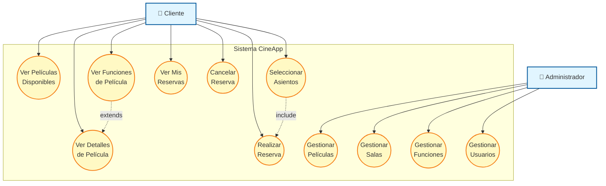

# Diagrama de Casos de Uso para CineApp

Este documento presenta los Diagramas de Casos de Uso para la aplicación CineApp, describiendo las interacciones entre los actores y el sistema.

## Actores

*   **Cliente**: Un usuario que interactúa con el sistema para buscar películas y realizar reservas.
*   **Administrador**: Un usuario con privilegios para gestionar el contenido y la configuración del sistema (implícito en la descripción del sistema, aunque no completamente implementado).

## Diagrama de Casos de Uso

## Descripción de Casos de Uso

### Casos de Uso del Cliente

*   **UC1: Ver Películas Disponibles**
    *   **Descripción**: El cliente puede navegar y ver una lista de todas las películas que se están proyectando.
    *   **Actor Principal**: Cliente
*   **UC2: Ver Detalles de Película**
    *   **Descripción**: El cliente puede seleccionar una película de la lista para ver información detallada como sinopsis, género, duración, etc.
    *   **Actor Principal**: Cliente
*   **UC3: Ver Funciones de Película**
    *   **Descripción**: El cliente puede ver los horarios y salas disponibles para una película seleccionada.
    *   **Actor Principal**: Cliente
*   **UC4: Seleccionar Asientos**
    *   **Descripción**: Después de elegir una función, el cliente puede seleccionar los asientos deseados en la sala.
    *   **Actor Principal**: Cliente
*   **UC5: Realizar Reserva**
    *   **Descripción**: El cliente finaliza el proceso de reserva de entradas para una función y asientos seleccionados.
    *   **Actor Principal**: Cliente
*   **UC6: Ver Mis Reservas**
    *   **Descripción**: El cliente puede acceder a un historial de sus reservas realizadas.
    *   **Actor Principal**: Cliente
*   **UC7: Cancelar Reserva**
    *   **Descripción**: El cliente puede cancelar una reserva existente dentro de un plazo determinado.
    *   **Actor Principal**: Cliente

### Casos de Uso del Administrador (Conceptuales)

*   **UC8: Gestionar Películas**
    *   **Descripción**: El administrador puede añadir, editar o eliminar información de películas.
    *   **Actor Principal**: Administrador
*   **UC9: Gestionar Salas**
    *   **Descripción**: El administrador puede añadir, editar o eliminar salas de cine y su capacidad.
    *   **Actor Principal**: Administrador
*   **UC10: Gestionar Funciones**
    *   **Descripción**: El administrador puede programar, modificar o cancelar funciones de películas.
    *   **Actor Principal**: Administrador
*   **UC11: Gestionar Usuarios**
    *   **Descripción**: El administrador puede gestionar las cuentas de usuario (clientes y otros administradores).
    *   **Actor Principal**: Administrador
