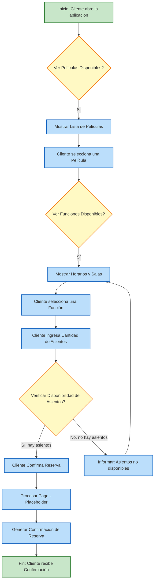

# Diagrama de Flujo de Trabajo (Workflow) para CineApp

Este documento presenta un diagrama de flujo de trabajo que describe el proceso típico de un cliente al reservar entradas en la aplicación CineApp.

## Flujo de Reserva de Entradas

